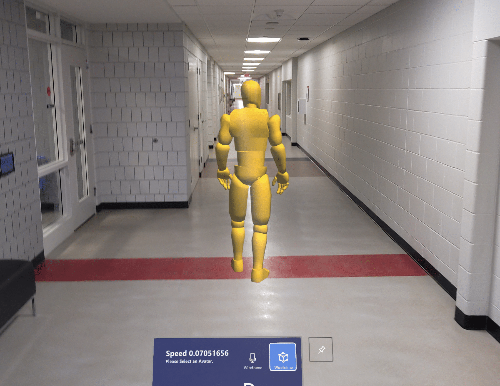

# Gait Training Application

## Overview
Gait disorders, which affect people of all ages globally, are a prevalent problem that not only limits mobility but also increases the risk of falls and diminishes the quality of life. As a result, gait training plays a crucial role in overall well-being, particularly among the elderly. Numerous systems have been created to tackle this issue. This study introduces an innovative approach to facilitate gait training using mixed reality. We present a portable mixed reality system explicitly developed to assist individuals with gait disabilities.

The proposed system utilizes an avatar to deliver visual cues to patients, leveraging the proteus effect and complexity matching to reinstate a natural gait. The proteus effect denotes the phenomenon in which individuals assimilate the qualities of their virtual avatars, while complexity matching involves synchronizing movements by imitating the complexity of others. Both theories are supported by reputable scientific research. A preliminary study demonstrated the effectiveness of this approach in restoring gait patterns. To further assess its viability, the system is presently undergoing extensive human trials on a larger scale.
A HoloLens 2 based mixed reality gait training application

Please Click [Here](https://youtu.be/7yjcnMINi7E) to see a brief demo.
 

 
## Installation and Documentation

Please Click [Here](https://pubudus.github.io/Gait_Training/) to go to the documentation website. Installation instruction are also avaiable in the website.

Please Click [Here](https://docs.google.com/document/d/1sArsxUCgi7hbih2fWuz-6Y9xhteBZqwShzXI0Kjo5ts/edit?usp=sharing) to access our dev journal where we documented all of our design approaches.